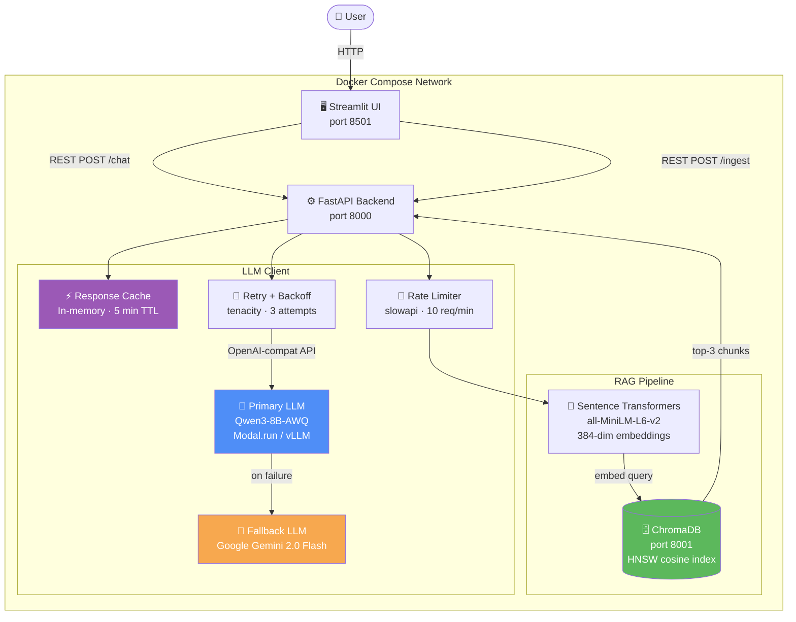

# Week 15 — AI Assistant

Full-stack, production-ready AI assistant with RAG, tool calling, structured output, and Docker deployment.

---

## Architecture



### Request flow

1. User sends a message from the Streamlit UI.
2. FastAPI checks the in-memory **response cache** (5-min TTL). Cache hit → return immediately.
3. If `use_rag=true`, the query is embedded and the top-3 similar chunks are retrieved from **ChromaDB**.
4. Retrieved context is prepended to the user message and sent to the **LLM client**.
5. The LLM client calls the **primary model** (Qwen3-8B-AWQ on Modal/vLLM) with retry/backoff.
6. If the primary fails after 3 attempts, the **Gemini fallback** is tried automatically.
7. If the model requests a **tool call** (calculator, get_datetime), the tool loop executes and the result is fed back before the final response.
8. The response, sources, and tool call log are returned to the UI.

---

## Features

| Feature | Implementation |
|---------|----------------|
| LLM Integration | OpenAI-compatible client → Qwen3-8B-AWQ on Modal/vLLM |
| Prompt Engineering | System prompt, configurable `temperature` + `top_p` |
| Structured Output | `/chat/json` endpoint — instructs model to return JSON |
| Tool Calling | `calculator`, `get_datetime` via OpenAI function-calling format |
| RAG Pipeline | Sentence Transformers embeddings → ChromaDB HNSW vector store |
| Local/OSS Model | Qwen3-8B-AWQ served via vLLM (OpenAI-compatible) |
| Containerization | Multi-stage Dockerfile + Docker Compose with health checks |
| Web UI | Streamlit — chat, document ingestion, source/tool display |
| Rate Limiting | slowapi — 10 req/min `/chat`, 5 req/min `/ingest` |
| Retry + Backoff | tenacity — exponential backoff on RateLimitError / ConnectionError |
| Fallback Model | Google Gemini 2.0 Flash if primary is unreachable |
| Response Cache | In-memory SHA-256 keyed cache, 5-min TTL |

### ONNX note

ONNX conversion is not applicable to the primary LLM (Qwen3) because the model runs as a remote vLLM service — weights are not accessible for export. The local embedding model (`all-MiniLM-L6-v2`) can be exported to ONNX via `optimum-cli` for faster CPU inference if needed.

---

## Quick Start

### Docker Compose (recommended)

```bash
# 1. Copy and fill in your API keys
cp .env.example .env

# 2. Build and start all services
docker compose up --build

# 3. Open the UI
open http://localhost:8501

# API docs
open http://localhost:8000/docs
```

### Local development

```bash
# Install backend deps
pip install -r requirements.txt

# Install UI deps
pip install -r requirements-ui.txt

# Start ChromaDB (needs Docker)
docker run -p 8001:8000 -e IS_PERSISTENT=TRUE chromadb/chroma:0.5.23

# Set env vars
export $(cat .env | grep -v '#' | xargs)
export CHROMA_HOST=localhost CHROMA_PORT=8001

# Start backend
uvicorn app.main:app --reload --port 8000

# Start UI (separate terminal)
API_URL=http://localhost:8000 streamlit run ui/app.py
```

---

## API Reference

### `GET /health`
Returns service status and model names.

```json
{"status": "ok", "primary_model": "Qwen/Qwen3-8B-AWQ", "fallback_model": "gemini-2.0-flash"}
```

### `POST /ingest`
Add text to the knowledge base. Rate-limited to **5 req/min**.

```json
{
  "text": "Your document text here...",
  "metadata": {"source": "docs/faq.txt"}
}
```

Response:
```json
{"status": "success", "chunks_added": 12}
```

### `POST /chat`
Chat with RAG and tool calling. Rate-limited to **10 req/min**.

```json
{
  "messages": [{"role": "user", "content": "What is 2^10?"}],
  "use_rag": true,
  "temperature": 0.1,
  "top_p": 0.9
}
```

Response:
```json
{
  "response": "2^10 = 1024",
  "sources": [{"content": "...", "metadata": {}}],
  "tool_calls": [{"tool": "calculator", "input": {"expression": "2**10"}, "result": "1024"}],
  "model_used": "Qwen/Qwen3-8B-AWQ",
  "cached": false
}
```

### `POST /chat/json`
Same as `/chat` but instructs the model to return structured JSON.

---

## Environment Variables

| Variable | Description | Default |
|----------|-------------|---------|
| `LLAMA_BASE_URL` | vLLM/llama.cpp OpenAI-compatible base URL | *(required)* |
| `LLAMA_MODEL` | Model name on the vLLM server | `Qwen/Qwen3-8B-AWQ` |
| `LLAMA_API_KEY` | API key for the vLLM endpoint | `none` |
| `LLAMA_MAX_TOKENS` | Max tokens per completion | `768` |
| `LLAMA_TEMP` | Default temperature | `0.1` |
| `GOOGLE_API_KEY` | Google AI Studio key for Gemini fallback | *(optional)* |
| `GEMINI_MODEL` | Gemini model name | `gemini-2.0-flash` |
| `CHROMA_HOST` | ChromaDB hostname | `chromadb` |
| `CHROMA_PORT` | ChromaDB port | `8000` |
| `MAX_RETRIES` | LLM retry attempts | `3` |
| `CACHE_TTL_SECONDS` | Response cache TTL | `300` |

---

## Project Structure

```
w15/
├── app/
│   ├── config.py          # pydantic-settings — reads from .env
│   ├── models.py          # Pydantic request/response models
│   ├── main.py            # FastAPI app — routes, rate limiting
│   ├── rag/
│   │   ├── ingestion.py   # Text chunking (word-based, overlapping)
│   │   ├── embeddings.py  # all-MiniLM-L6-v2 wrapper (lazy-loaded)
│   │   └── retriever.py   # ChromaDB add/query with retry on connect
│   └── llm/
│       ├── client.py      # Primary + fallback LLM, tool loop, cache
│       └── tools.py       # Tool definitions + execute_tool()
├── ui/
│   └── app.py             # Streamlit frontend
├── data/
│   └── sample.txt         # Pre-loaded demo document
├── Dockerfile             # Multi-stage backend image (model pre-cached)
├── Dockerfile.ui          # UI image
├── docker-compose.yml     # Orchestrates chromadb + app + ui
├── requirements.txt       # Backend deps
├── requirements-ui.txt    # UI deps
└── .env.example           # Template — copy to .env
```
