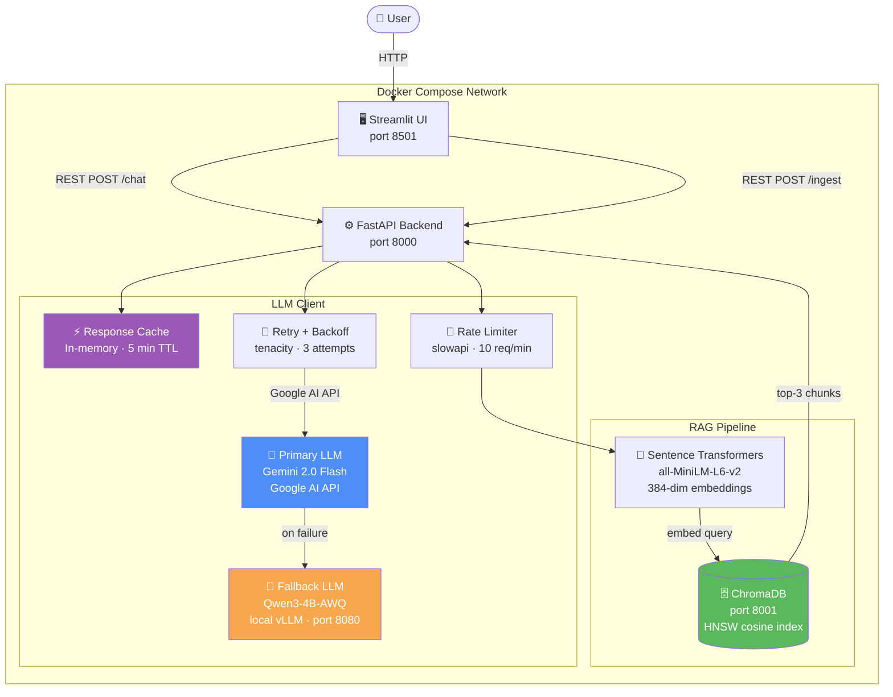

# Week 15 — AI Assistant

Full-stack, production-ready AI assistant with RAG, tool calling, structured output, and Docker deployment.

---

## Architecture



### Request flow

1. User sends a message from the Streamlit UI.
2. FastAPI checks the in-memory **response cache** (5-min TTL). Cache hit → return immediately.
3. If `use_rag=true`, the query is embedded and the top-3 similar chunks are retrieved from **ChromaDB**.
4. Retrieved context is prepended to the user message and sent to the **LLM client**.
5. The LLM client calls the **primary model** (Gemini 2.0 Flash) with retry/backoff.
6. If Gemini fails after 3 attempts, **Qwen3-4B-AWQ** (local vLLM) is tried automatically.
7. If the model requests a **tool call** (`calculator`, `get_datetime`), the tool loop executes and feeds the result back before the final response. Qwen3 `<think>` tokens are stripped before returning.
8. The response, sources, and tool call log are returned to the UI.

---

## Features

| Feature | Implementation |
|---------|----------------|
| LLM Integration | Gemini 2.0 Flash (primary) via OpenAI-compatible client |
| Local OSS Model | Qwen3-4B-AWQ served via vLLM (fallback, GPU required) |
| Prompt Engineering | System prompt, configurable `temperature` + `top_p` |
| Structured Output | `/chat/json` endpoint — instructs model to return JSON |
| Tool Calling | `calculator`, `get_datetime` via OpenAI function-calling format |
| RAG Pipeline | Sentence Transformers embeddings → ChromaDB HNSW vector store |
| Auto Ingest | `data/sample.txt` auto-ingested on startup if collection is empty |
| Containerization | Multi-stage Dockerfile + Docker Compose with health checks |
| Web UI | Streamlit — ChatGPT-style UI, document ingestion, sources/tool display |
| Rate Limiting | slowapi — 10 req/min `/chat`, 5 req/min `/ingest`, 3 req/min `/chat/batch` |
| Retry + Backoff | tenacity — exponential backoff on RateLimitError / ConnectionError |
| Fallback Model | Qwen3-4B-AWQ via local vLLM if Gemini unreachable |
| Response Cache | In-memory SHA-256 keyed cache, 5-min TTL |
| Batch Processing | `/chat/batch` — concurrent requests via `asyncio.gather` + semaphore |

### ONNX note

ONNX export is not applicable to Gemini (closed API, no weight access) or Qwen3 served via vLLM (weights managed by vLLM runtime). The local embedding model (`all-MiniLM-L6-v2`) can be exported to ONNX via `optimum-cli` for faster CPU inference if needed.

---

## Quick Start

### Docker Compose (recommended)

```bash
# 1. Copy and configure API keys
cp .env.example .env
# Edit .env — set GOOGLE_API_KEY (from https://aistudio.google.com/apikey)

# 2. Build and start core services (chromadb + app + ui)
docker compose up --build

# 3. Open the UI
http://localhost:8501

# API docs (Swagger)
http://localhost:8000/docs
```

### With local vLLM fallback (NVIDIA GPU required, 6GB+ VRAM)

```bash
# Start vLLM — downloads Qwen3-4B-AWQ automatically (~3GB, cached after first run)
docker compose --profile vllm up vllm -d

# Watch download + load progress
docker compose logs vllm -f | grep -E "Loading|Downloading|startup complete|error"

# Update .env to point fallback at local vLLM
LLAMA_BASE_URL=http://vllm:8000/v1
LLAMA_MODEL=Qwen/Qwen3-4B-AWQ

# Rebuild app to pick up new env
docker compose up --build app -d
```

vLLM is ready when logs show `Application startup complete`. Test it:
```bash
curl http://localhost:8080/v1/models
```

### Local development (no Docker)

```bash
pip install -r requirements.txt
pip install -r requirements-ui.txt

# Start ChromaDB
docker run -p 8001:8000 -e IS_PERSISTENT=TRUE chromadb/chroma:0.5.23

export $(cat .env | grep -v '#' | xargs)
export CHROMA_HOST=localhost CHROMA_PORT=8001

uvicorn app.main:app --reload --port 8000

# Separate terminal
API_URL=http://localhost:8000 streamlit run ui/app.py
```

---

## API Reference

### `GET /health`
```json
{"status": "ok", "primary_model": "gemini-2.0-flash", "fallback_model": "Qwen/Qwen3-4B-AWQ"}
```

### `POST /ingest`
Add text to knowledge base. Rate-limited to **5 req/min**.
```json
{"text": "Your document text...", "metadata": {"source": "docs/faq.txt"}}
```
```json
{"status": "success", "chunks_added": 12}
```

### `POST /chat`
Chat with RAG + tool calling. Rate-limited to **10 req/min**.
```json
{
  "messages": [{"role": "user", "content": "What is 2^10?"}],
  "use_rag": true,
  "temperature": 0.1,
  "top_p": 0.9
}
```
```json
{
  "response": "2^10 = 1024",
  "sources": [{"content": "...", "metadata": {}}],
  "tool_calls": [{"tool": "calculator", "input": {"expression": "2**10"}, "result": "1024"}],
  "model_used": "gemini-2.0-flash",
  "cached": false
}
```

### `POST /chat/json`
Same as `/chat` but forces JSON-only response.

### `POST /chat/batch`
Process up to 20 requests concurrently. Rate-limited to **3 req/min**.
```json
{
  "requests": [
    {"messages": [{"role": "user", "content": "Q1"}]},
    {"messages": [{"role": "user", "content": "Q2"}]}
  ],
  "max_concurrency": 5
}
```
```json
{
  "results": [
    {"index": 0, "response": {...}, "error": null},
    {"index": 1, "response": {...}, "error": null}
  ],
  "total": 2, "succeeded": 2, "failed": 0
}
```

---

## Environment Variables

| Variable | Description | Default |
|----------|-------------|---------|
| `GOOGLE_API_KEY` | Google AI Studio key (primary LLM) | *(required)* |
| `GEMINI_MODEL` | Gemini model name | `gemini-2.0-flash` |
| `LLAMA_BASE_URL` | vLLM OpenAI-compatible base URL (fallback) | `http://vllm:8000/v1` |
| `LLAMA_MODEL` | Model loaded in vLLM | `Qwen/Qwen3-4B-AWQ` |
| `LLAMA_API_KEY` | vLLM API key | `none` |
| `LLAMA_MAX_TOKENS` | Max tokens per completion | `768` |
| `LLAMA_TEMP` | Default temperature | `0.1` |
| `ENABLE_TOOLS` | Enable function calling | `true` |
| `CHROMA_HOST` | ChromaDB hostname | `chromadb` |
| `CHROMA_PORT` | ChromaDB port | `8000` |
| `MAX_RETRIES` | LLM retry attempts | `3` |
| `CACHE_TTL_SECONDS` | Response cache TTL | `300` |

---

## Project Structure

```
w15/
├── app/
│   ├── config.py          # pydantic-settings — reads from .env
│   ├── models.py          # Pydantic request/response schemas
│   ├── main.py            # FastAPI — routes, rate limiting, startup ingest
│   ├── rag/
│   │   ├── ingestion.py   # Word-based overlapping text chunker
│   │   ├── embeddings.py  # all-MiniLM-L6-v2 (lazy-loaded, pre-cached in image)
│   │   └── retriever.py   # ChromaDB add/query, auto-reconnect on failure
│   └── llm/
│       ├── client.py      # Gemini primary → Qwen fallback, tool loop, <think> strip, cache
│       └── tools.py       # calculator + get_datetime (OpenAI function format)
├── ui/
│   └── app.py             # Streamlit — ChatGPT-style UI
├── data/
│   └── sample.txt         # Auto-ingested on first startup
├── Dockerfile             # Multi-stage — embedding model pre-downloaded in build
├── Dockerfile.ui
├── docker-compose.yml     # chromadb + app + ui + vllm (optional --profile vllm)
├── requirements.txt
├── requirements-ui.txt
└── .env.example
```
