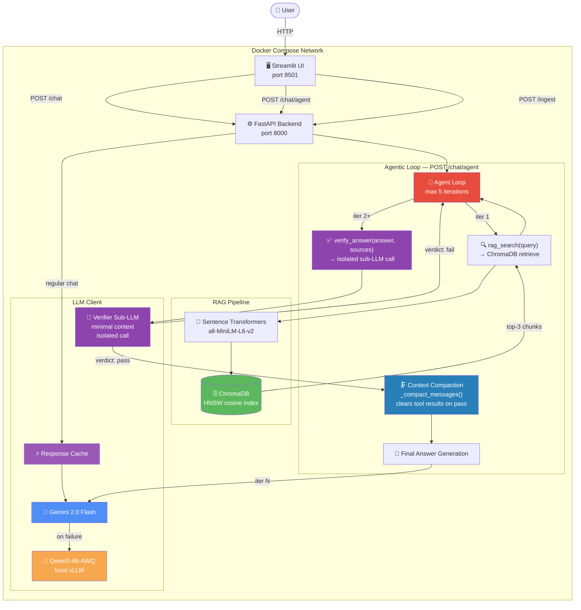

# Week 16 — Agentic AI Assistant

Extends the W15 RAG assistant with a self-check agentic loop, context engineering, and an evaluation harness.

---

## Architecture



### Agentic loop flow

1. User query hits `POST /chat/agent`.
2. Agent calls `rag_search(query)` → ChromaDB returns top-3 chunks.
3. Agent drafts an answer, then calls `verify_answer(answer, sources)`.
4. `verify_answer` makes an **isolated sub-LLM call** with only the answer + sources (no conversation history).
5. Verdict `pass` → `_compact_messages()` strips all tool results from context → agent generates final answer.
6. Verdict `fail` → agent decides: re-search with refined query, or answer with explicit uncertainty caveat.
7. Hard stop at **5 iterations**.

---

## W16 Documentation

### a. Context Engineering Technique

**Technique: Clearing tool results after successful verification**

**Problem:** In a multi-iteration loop, each `rag_search` and `verify_answer` tool call appends a tool-call message and a tool-result message to the context. By the time the agent reaches the final answer generation turn, the message history contains 4–8 extra messages of raw retrieval output and JSON verdicts. This inflates input token cost and clutters the context with information that is no longer needed — the model has already used it.

**Where applied:** `app/agent/loop.py` → `_compact_messages()`. Called immediately when `verify_answer` returns `verdict: pass`. Replaces the entire accumulated message list with three messages: system prompt + user query + a short assistant note summarizing that verified sources are available. The model then generates the final answer from this clean, minimal context.

**Effect:** Reduces token cost on the final generation turn. On a typical 3-iteration flow (search → verify → answer), compaction eliminates ~60% of input tokens for the last call.

A second isolation technique is applied inside `verify_answer` itself: the verifier sub-LLM call receives only the candidate answer and the source text — no system prompt, no conversation history. This prevents the self-verification paradox where the same context that produced the answer also judges it.

---

### b. Agentic Pattern

**Single-agent loop.**

The self-check task has a strictly sequential dependency chain: retrieve → draft → verify → (re-retrieve or answer). There is no work that can be parallelized without breaking this dependency, and no role boundary that would benefit from specialization. A second persistent agent would add coordination overhead and inter-agent message passing with no gain.

The verifier sub-call in `verify_answer` is isolated context-wise but is not a separate agent — it is a stateless, single-turn LLM call executing within the tool handler. It has no memory, no tools, and no loop. This avoids the self-verification paradox (a benefit of context isolation) without the cost of multi-agent coordination.

Using the five structural failures framework: this task has no context saturation risk (compaction handles it), no sequential bottleneck (one query at a time is fine), and no skill dilution (retrieval and verification are handled by one capable model). Multi-agent would introduce a single point of failure at the coordinator without solving any of these.

---

### c. Evaluation Harness

**Source:** `eval/run_eval.py` — built from scratch, no external eval frameworks.

**Test cases:** 10 queries spanning simple KB lookups, out-of-KB queries, complex comparisons, math tool use, and guaranteed no-match queries.

**Metrics measured per query:**

| Metric | How measured |
|--------|-------------|
| Task completion rate | `response` field non-empty and HTTP 200 |
| Tool-call correctness | Expected tool subset ⊆ actual tools called |
| Trajectory length | `iterations` field from agent response |
| Token usage | `tokens.input`, `tokens.output`, `tokens.total` (accumulated across all iterations including verify sub-call) |
| Failure type | Classified post-run by `classify_failure()` |

**Failure taxonomy:**

| Type | Definition |
|------|-----------|
| `hard` | Empty response, HTTP error, or crash |
| `soft` | Completed but unverified; answer may be unsupported |
| `cascading_soft` | Multiple re-searches attempted, verification still failed |

Run: `python eval/run_eval.py --base-url http://localhost:8000 --output eval/results.md`

---

### Additional Requirements

**1. Skill vs. Agent**

`rag_search` cannot be a Skill because it requires runtime execution (a vector DB query with dynamic embeddings) that a static prompt template cannot perform. `verify_answer` could theoretically be a Skill (a structured prompt), but implementing it as a tool call that triggers a live LLM sub-call provides a real, observable verdict rather than relying on the same model to self-assess within its own context — avoiding the self-verification paradox.

**2. Token and Cost Accounting**

The eval harness accumulates tokens across all loop iterations per query, including the verify sub-call. Each result row in `eval/results.md` shows `tokens_input`, `tokens_output`, and `tokens_total`. A single-agent baseline comparison can be run by calling `POST /chat` (W15 pipeline) with the same queries and comparing token totals. The expected overhead for the agentic loop is 2–4× due to multi-turn context and the verify sub-call.

**3. Failure Injection Test**

To inject failure: in `app/agent/loop.py`, replace `_execute_rag_search` with a function that raises `RuntimeError("Tool unavailable")`. Run eval with `python eval/run_eval.py --inject-failure`.

Expected behavior: the agent receives a tool error result. A well-behaved agent should acknowledge it cannot retrieve information and either ask the user for clarification or answer with an explicit caveat ("I was unable to search the knowledge base"). A hallucinating agent would produce a confident answer without sources — this is the failure mode to detect. The `verified` field will be `false` and `failure_type` will be `soft` if the agent proceeds without sources.

**4. Tool vs. Agent Boundary**

ChromaDB is modeled as a **bounded tool call** (`rag_search`). It is stateless: each call takes a query string and returns a ranked list of chunks. There is no session, no conversation history, and no multi-step coordination required. Modeling it as an agent-to-agent interaction would require a persistent sub-agent process, message routing, and result serialization — all overhead with no benefit for a single-shot retrieval operation. The tool boundary is the correct abstraction: the main agent owns the loop state; ChromaDB is a pure function.

---

## Features

| Feature | Implementation |
|---------|----------------|
| **Agentic Loop** | Self-check before responding — `POST /chat/agent`, max 5 iterations |
| **Context Compaction** | Tool results cleared after verify pass — `_compact_messages()` |
| **Isolated Verifier** | `verify_answer` sub-LLM call with minimal context |
| **Evaluation Harness** | `eval/run_eval.py` — 10 cases, 4 metrics, failure taxonomy |
| LLM Integration | Gemini 2.0 Flash (primary) via OpenAI-compatible client |
| Local OSS Model | Qwen3-4B-AWQ served via vLLM (fallback, GPU required) |
| Prompt Engineering | System prompt, configurable `temperature` + `top_p` |
| Structured Output | `/chat/json` — instructs model to return JSON |
| Tool Calling | `calculator`, `get_datetime`, `rag_search`, `verify_answer` |
| RAG Pipeline | Sentence Transformers → ChromaDB HNSW vector store |
| Auto Ingest | `data/sample.txt` auto-ingested on startup if collection is empty |
| Containerization | Multi-stage Dockerfile + Docker Compose with health checks |
| Web UI | Streamlit — ChatGPT-style UI, document ingestion, sources/tool display |
| Rate Limiting | slowapi — 10/min `/chat`, 5/min `/ingest`, 3/min `/batch`, 5/min `/agent` |
| Retry + Backoff | tenacity — exponential backoff on RateLimitError / ConnectionError |
| Response Cache | In-memory SHA-256 keyed cache, 5-min TTL (regular `/chat` only) |
| Batch Processing | `/chat/batch` — concurrent requests via `asyncio.gather` + semaphore |

---

## Quick Start

### Docker Compose (recommended)

```bash
cp .env.example .env
# Edit .env — set GOOGLE_API_KEY

docker compose up --build

# UI
http://localhost:8501

# API docs
http://localhost:8000/docs
```

### Run eval harness

```bash
pip install requests
python eval/run_eval.py --base-url http://localhost:8000 --output eval/results.md
```

### Local development

```bash
pip install -r requirements.txt pip install -r requirements-ui.txt

docker run -p 8001:8000 -e IS_PERSISTENT=TRUE chromadb/chroma:0.5.23

export $(cat .env | grep -v '#' | xargs)
export CHROMA_HOST=localhost CHROMA_PORT=8001

uvicorn app.main:app --reload --port 8000
```

---

## API Reference

### `POST /chat/agent`
Agentic self-check loop. Rate-limited to **5 req/min**.
```json
{"query": "What are the main topics in the knowledge base?", "temperature": 0.1, "top_p": 0.9}
```
```json
{
  "response": "The knowledge base covers...",
  "sources": [{"content": "...", "metadata": {}}],
  "tool_calls": [
    {"tool": "rag_search", "input": {"query": "main topics"}, "result": "..."},
    {"tool": "verify_answer", "input": {"answer": "...", "sources": "..."}, "result": "{\"verdict\": \"pass\", \"reason\": \"...\"}"}
  ],
  "model_used": "gemini-2.0-flash",
  "iterations": 3,
  "verified": true,
  "tokens": {"input": 1240, "output": 187, "total": 1427}
}
```

### `GET /health`
```json
{"status": "ok", "primary_model": "gemini-2.0-flash", "fallback_model": "Qwen/Qwen3-4B-AWQ"}
```

### `POST /ingest`
```json
{"text": "Your document text...", "metadata": {"source": "docs/faq.txt"}}
```

### `POST /chat`
Standard RAG + tool calling (W15, unchanged).

### `POST /chat/json`
Same as `/chat` but forces JSON-only response.

### `POST /chat/batch`
Up to 20 concurrent requests. Rate-limited to **3 req/min**.

---

## Environment Variables

| Variable | Description | Default |
|----------|-------------|---------|
| `GOOGLE_API_KEY` | Google AI Studio key | *(required)* |
| `GEMINI_MODEL` | Gemini model name | `gemini-2.0-flash` |
| `LLAMA_BASE_URL` | vLLM base URL (fallback) | `http://vllm:8000/v1` |
| `LLAMA_MODEL` | Model loaded in vLLM | `Qwen/Qwen3-4B-AWQ` |
| `LLAMA_MAX_TOKENS` | Max tokens per completion | `768` |
| `LLAMA_TEMP` | Default temperature | `0.1` |
| `ENABLE_TOOLS` | Enable function calling | `true` |
| `CHROMA_HOST` | ChromaDB hostname | `chromadb` |
| `CHROMA_PORT` | ChromaDB port | `8000` |
| `CACHE_TTL_SECONDS` | Response cache TTL | `300` |

---

## Project Structure

```
w16/
├── app/
│   ├── agent/
│   │   └── loop.py        # Agentic loop — self-check, compaction, MAX_ITERATIONS=5
│   ├── config.py
│   ├── models.py          # + AgentChatRequest, AgentChatResponse, AgentTokenUsage
│   ├── main.py            # + POST /chat/agent
│   ├── rag/
│   │   ├── ingestion.py
│   │   ├── embeddings.py
│   │   └── retriever.py
│   └── llm/
│       ├── client.py
│       └── tools.py       # + AGENT_TOOLS (rag_search, verify_answer schemas)
├── eval/
│   └── run_eval.py        # Evaluation harness — 10 cases, 4 metrics
├── ui/
│   └── app.py
├── data/
│   └── sample.txt
├── Dockerfile
├── Dockerfile.ui
├── docker-compose.yml
├── requirements.txt
├── requirements-ui.txt
└── .env.example
```
